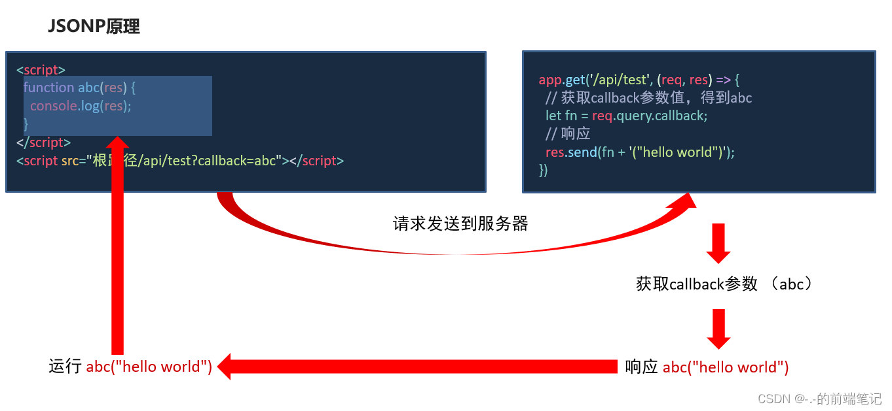
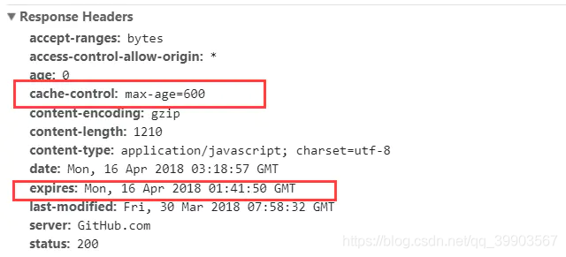

## js面试题汇总

### 讲一下 var、let、const 的区别?
> - var 声明的变量有变量提升的特性，而 let、const 没有
> - var 声明的变量会挂载到 windows 对象上，所以使用 var 声明的是全局变量，而 let 和 const 声明的变量是局部变量, 块级作用域外不能访问
> - 同一作用域下 let 和 const 不能重复声明同名变量，而var可以
> - const声明的是常量，必须赋初值，一旦声明不能再次赋值修改，如果声明的是复合类型数据，可以修改其属性

### js中的基础数据类型有哪几种? 了解包装对象吗？
> - 六种，string, number, boolean, undefined, null, symbol
> - 基础数据类型临时创建的临时对象，称为包装对象。其中 number、boolean 和 string 有包装对象，代码运行的过程中会找到对应的包装对象，然后包装对象把属性和方法给了基本类型，然后包装对象被系统进行销毁。
> - 基本类型直接把变量名和值储存在栈中，引用数据类型值存在堆中，变量名和堆对应的地址存储在栈中。

### 如何判断this指向？箭头函数的this指向什么？
> - 普通函数直接调用中的this，this 指向 window 对象，严格模式下为 undefined。
> - 在对象里调用的this指向调用函数的那个对象，this: 谁调用就指向谁
> - 在构造函数以及类中的this通过new关键字指向实例对象
> - 绑定事件函数的this谁调用就指向谁。
> - 定时器中的this指向 window，因为定时器中采用回调函数作为处理函数，而回调函数的 this 指向 window。
> - 箭头函数中的this会继承其父作用域的 this。

### call apply bind 的作用与区别？
> - 作用：改变函数内部 this 的指向
> - 区别：call 和 apply 会调用函数，而 bind 不会调用。call 和 bind 的参数是 参数列表逐个传入，而 apply 的参数必须为数组形式

### 什么是闭包？
> - 闭包是指能够访问另一个函数作用域中的变量的一个函数。 在js中，只有函数内部的子函数才能访问局部变量， 所以闭包可以理解成 “定义在一个函数内部的函数”。
> - 利用闭包可以突破作用链域，将函数内部的变量和方法传递到外部，让外部函数可以访问到内部函数的变量和方法。
> - 正常的函数，在执行完之后，函数里面声明的变量会被垃圾回收机制处理掉。但是形成闭包的函数在执行之后，不会被回收，依旧存在内存中。
> - 因为变量不会被回收，所以内存中一直存在，耗费内存。

### js同步任务和异步任务
> - 同步任务是指在主线程上排队执行的任务，只有前一个任务执行完毕，才能继续执行下一个任务。
> - 异步任务分为 宏任务 和 微任务，异步任务指的是，不进入主线程、而进入"任务队列"的任务，只有等主线程任务执行完毕，"任务队列"的任务才会进入主线程执行。
> - 事件循环：先执行同步任务，再执行当前所有的微任务，然后执行一个宏任务，然后再执行所有的微任务。再执行一个宏任务。再执行所有的微任务·······依次类推到执行结束。
> - 常见的宏任务：settimeout setInterval script(最外层的script标签)，会压入到调用栈中，宏任务会等到调用栈清空之后再执行
> - 常见的微任务：promise (async await)，会在调用栈清空时立即执行(优先级大于宏任务), 调用栈中加入的微任务会立马执行

### 如何理解 script（整体代码块）是个宏任务呢
> - 实际上如果同时存在两个 script 代码块，会首先在执行第一个 script 代码块中的同步代码，如果这个过程中创建了微任务并进入了微任务队列，第一个 script 同步代码执行完之后，会首先去清空微任务队列，再去开启第二个 script 代码块的执行。所以这里应该就可以理解 script（整体代码块）为什么会是宏任务。

### 什么是回调函数，回调函数存在什么问题
> - 回调函数就是一个通过函数指针调用的函数。把函数的指针 (内存地址) 作为参数传递给另一个函数，当这个指针被用来调用其所指向的函数时，指向的函数就是回调函数。回调函数不是由该函数的实现方直接调用，而是在特定的事件或条件发生时由另外的一方调用的，用于对该事件或条件进行响应。
> - 使用回调函数有一个很大缺点就是造成回调地狱，回到地狱是为了实现某些逻辑出现函数的层层嵌套，可以通过promise代替。

### 什么是高阶函数
> - 高阶函数是一个 **接收函数作为参数或将函数作为输出返回** 的函数

### 浏览器为什么要阻止跨域请求？每次跨域请求会达到服务端吗？
> - 浏览器阻止跨域请求的原因是因为"同源政策" , "同源政策"主要解决浏览器的安全问题，同源策略会阻止一个域的javascript脚本和另外一个域的内容进行交互，减少被攻击的媒介，"同源"是 协议、域名 和 端口都相同，非同源是 协议 域名 和 端口 只要有一个不同都是非同源，就会有跨域问题
> - 服务端不会拦截跨域请求，拦截是在浏览器端的，请求一定是先发出去，在返回来的时候被浏览器拦截了，如果请求是有返回值的，会被浏览器隐藏掉。
> - 通常浏览器在发送请求时会发送一个预检请求（options方法）询问服务端是不是允许这次请求。服务端会在返回的请求上返回一些header，从而告诉客户端是否要发送真正的请求，如果可以，浏览器才会发送真正的请求。
> - 但是简单请求不会发送预检请求，只有复杂请求会。

### 什么是简单请求？
> 是否为简单请求要同时满足以下四个条件：
> - 使用下列方法之一： GET HEAD POST
> - 只使用了安全 Header（如：multipart/form-data Accept-Language Content-Type），不得人为设置其他 Header
> - 请求中的任意 XMLHttpRequest 对象均没有注册任何事件监听器
> - 求中没有使用 ReadableStream 对象（可读的字节数据流）。

### 如何解决跨域？
> - 使用JSONP，通过script标签的src属性获取get请求  

> - 前端代理转发，devServer中配置代理，让请求通过同源地址代理到真实地址
> - nginx反向代理（生产常用）
> - 服务端过滤器配置过滤器，给响应头加上Access-Control-Allow-Origin属性声明允许跨域访问
> - 浏览器安装Allow CORS插件绕过同源策略
> - 使用postman请求

### 对内存泄漏的了解
> - 定义：程序中已在堆中分配的内存，因为某种原因未释放或者无法释放的问题
> - 导致内存泄漏的原因：意外的全局变量、DOM元素清空时，还存在引用，DOM元素清空时，还存在引用、闭包、遗忘的定时器

### js事件模型
> js事件模型分为原始事件模型、标准事件模型、IE事件模型（不用）
> - 原始事件模型：事件绑定监听函数比较简单， 有两种方式，只支持冒泡，不支持捕获且同一个类型的事件只能绑定一次，后绑定的事件会覆盖之前的事件  
    1. HTML代码中直接绑定  
    ```
    <input type="button" onclick="fun()">
    ```  
    2. 通过JS代码绑定  
    ```
     var btn = document.getElementById('.btn')
     btn.onclick = fun;
    ```  
> - 标准事件模型：在该事件模型中，一次事件共有三个过程:  
    1. 事件捕获阶段：事件从document一直向下传播到目标元素, 依次检查经过的节点是否绑定了事件监听函数，如果有则执行  
    2. 事件处理阶段：事件到达目标元素, 触发目标元素的监听函数  
    3. 事件冒泡阶段：事件从目标元素冒泡到document, 依次检查经过的节点是否绑定了事件监听函数，如果有则执行  
    事件绑定监听函数的方式如下:  
    ```addEventListener(eventType, handler, useCapture)```  
    事件移除监听函数的方式如下:
    ```removeEventListener(eventType, handler, useCapture)```  
    **useCapture**一个boolean用于指定是否在捕获阶段进行处理，一般设置为false与IE浏览器保持一致

### new 操作符具体干了什么?
> - 创建一个空对象，并且把 this 指向这个对象，同时还继承了该对象的原型
> - 属性和方法被加入到 this 引用的对象中
```javascript
function _new(constructer, ...arg) {
   // 创建一个空的对象
   let resultObj = {};
   // 链接该对象到原型,这样新对象就能访问到原型上面的方法
   resultObj.__proto__ = constructer.prototype;
   // 然后实现步骤3，将新创建的对象作为this的上下文
   let result = constructer.call(resultObj, ...arg);
   // 实现步骤4：如果该函数没有返回对象（即result不是一个对象），则返回this（即resultObj)
   return typeof result === 'object' ? result : resultobj
}
```

### typeof用法
> - typeof用于判断数据类型，返回值有6个字符串：string、number、undefined、boolean、object、function
> - 数字类型、typeof 返回的值是 number。比如说：typeof(1)，返回值是 number
> - 字符串类型，typeof 返回的值是 string。比如 typeof(“123”返回值是 string)
> - 布尔类型，typeof 返回的值是 boolean。比如 typeof(true)返回值是 boolean
> - 对象、数组、null 返回的值是 object。  
    比如 typeof(window)，typeof(document)，typeof(null) 返回的值都是 object
> - 函数类型，返回的值是 function  
    比如：typeof(eval)，typeof(Date)返回的值都是 function。
> - 不存在的变量、函数或者 undefined，将返回 undefined。  
    比如：typeof(abc)、typeof(undefined) 都返回 undefined

### instanceof能得到哪些类型
> - instanceof 用来判断对象的具体类型  object instanceof objectType
> - 其原理就是检测函数的prototype是否在被检测对象的原型链上
```javascript

console.log([] instanceof Array) // true
console.log({} instanceof Object) // true
console.log((()=>{}) instanceof Function) // true
 
// instanceof用来判断数组存在误区，原因是Array.prototype.__proto__ === Object.prototype
console.log(Array.prototype.__proto__ === Object.prototype) // true
console.log([] instanceof Object) // true
 
// instanceof用来判断函数存在误区，原因是Function.prototype.__proto__ === Object.prototype
console.log(Function.prototype.__proto__ === Object.prototype) // true
console.log((()=>{}) instanceof Object) // true
```

### 谈一谈箭头函数与普通函数的区别?
> - 不会进行函数提升
> - 没有自己的 this，this指向的是所在作用域指向的对象
> - 不能使用 new 关键字
> - 不可以使用 arguments 对象

### 函数提升和变量提升
> - 使用var声明的变量，函数的声明会进行声明提升，在最顶部执行，且函数优先于var声明
    的变量，函数内部如果用 var 声明了相同名称的外部变量，函数将不再向上寻找，
    函数作用域中var变量会提升到函数最顶部执行，普通函数也会提升到最顶部执行，
    匿名函数不会进行函数提升
> - 变量声明提升会将变量声明提升到作用域顶部，**但只会提升声明部分，不会提升赋值部分**

### == 和 ===的区别
> - == 只比较数值是否相等（比较对象和 === 一样需要判断引用地址）
> - === 要求数值相等，类型相同
> - Object.is()和 === 差不多，多一个比较 +0和 -0不相等，两个NAN相等

### attribute 和 property 的区别是什么
> - attribute是作为html中的属性名称，且可以自定义属性
> - property是作为在js中的属性名称，不能获取自定义属性
> - 对于 html 的标准属性来说，attribute 和 property 是同步的，是会自动更新的
    但是对于自定义的属性来说，他们是不同步的

### 数组(array)方法
> 1. forEach() 方法，用于遍历数组
> 2. map() 方法，用于处理数组，并返回一个数组
> 3. filter() 方法，用于过滤不需要的元素，返回需要的一个数组
> 4. some() 方法，有一个符合条件就返回true
> 5. every() 方法，全部符合才返回true
> 6. indexOf() 方法，查找元素下标，没有返回-1
> 7. push() 方法，在数组最后插入一个元素
> 8. unshift() 方法，在数组前插入一个元素
> 9. pop() 方法，取出第最后一个元素，并删除
> 10. shift() 方法，去除第一个元素，并删除
> 11. sort((a, b) => { return a - b }) 排序 要是返会小于0，就是a在前b在后
> 12. reverse() 反转
> 13. slice(start, end) 返回截断后的数组，不改变原数组
> 14. splice(start, number, value) 返回删除元素组成的数组，value 为插入项，改变原数组
> 15. concat()拼接多个数组，返回拼接后的数组

### 字符串（String）方法
> 1. toLowerCase() 此方法用于把字符串转为小写，并返回新的字符串。
> 2. toUpperCase() 此方法用于把字符串转为小写，并返回新的字符串。
> 3. concat() 拼接字符串
> 4. substr(start, number) 从start开始截取多少位
> 5. substring(Start, end) 从start开始到end - 1
> 6. replace() 替换
> 7. trim() 去除开头和结尾的空格
> 8. split() 根据符号分割字符串，返回一个数组，会改变原数组
> 9. slice(start, end) 返回截断后的字符串
> 10. indexOf() 返回第一次出现的位置

### number方法
> 1. isNaN() 是否数字
> 2. parseInt()
> 3. toFixed(a) a: 0-20 保留几位小数并四舍五入
> 4. toPrecision(a) a:1-100 保留有效数字从第一个不为0开始
> 5. toLocaleString()

### Js中Math常用方法
> - Math.abs()函数，返回一个数的绝对值 Math.abs(-10) = 10
> - Math.ceil()函数，返回大于或等于一个给定数的最小整数。Math.ceil(5.4) = 6
> - Math.cos()函数，返回一个值的余弦值。Math.sin(90 * Math.PI / 180) = 1
> - Math.floor()方法，返回小于或等于一个给定数字的最大整数 Math.floor(5.7) = 5
> - Math.round()，返回的是一个数字四舍五入的整数。Math.round(5.7) = 6
> - Math.min()方法，是可以返回指定一组数据中最小值。Math.min( 0, 100, -200, -140) = -200
> - Math.max()方法，是可返回指定数据中最大值。Math.max(0, 100, -200, -140)  = 100
> - Math.sqrt()方法，返回的是一个数的平方根。 Math.sqrt(4) = 2
> - Math.random()函数，返回一个浮点，伪随机数范围从0到小于1，从0往上不包括1
> - Math.trunc()函数，返回的是一个数的整数部分，不管正数还是负数，直接去掉小数点及之后的部分。

### JavaScript 原型，原型链 ? 有什么特点？
> - 原型分为隐式原型__proto__ 和 显式原型(prototype原型对象)，每个对象都有它的隐式原型__proto__，指向它对应构造函数的显式原型(prototype)
> - 无论何时，只要创建一个函数，就会为这个函数添加一个 prototype 属性
> - 构造函数的 prototype 指向原型对象，原型对象有一个 constructor 属性指回构造函数，每个构造函数生成的实例对象都有一个__proto__ 属性，这个属性也指向prototype。
> - 每个对象都有__proto__ 属性，这个属性指向prototype，当想访问对象的一个属性时，如果这个对象本身没有这个属性就会通过__proto__属性 查找，prototype也是对象，每个对象又有自己的__proto__ 属性，所以就会一直这样查找上去，直到找到这个属性，这就是原型链的概念。
> - 原型链就是对象沿着__proto__ 这条链逐步向上搜索，最顶层是 Object，Object 的__proto__ 是 null。

### 说说什么是事件代理(事件委托)?
> - 是 js 中常用绑定事件的常技巧。“事件代理”是把原本需要绑定的事件委托给父元素，让父元素担当事件监听的职务。事件代理的原理是 DOM 元素的事件冒泡。使用事件委托的好处是可以提高性能。
> - 可以大量节省内存占用，减少事件注册，当新增子对象时无需再次对其绑定。

### 什么是作用域，什么是作用域链？
> - 作用域是代码中定义变量的区域, js中采用词法作用域（静态作用域） 即函数作用域在函数定义时决定的。分为全局作用域和函数作用域。
> - 全局作用域：程序的任何地方都能访问如window对象的内置属性
> - 函数作用域：在函数中才能访问的属性，不同作用域下同名变量不会有冲突
> - ES6增加了块级作用域
> - 每个函数都有一个作用域链，查找变量或方法时，会先从函数作用域逐层查找最后到全局作用域查找，这些作用域的集合称为作用域链。

### 说说对浅拷贝 和 深拷贝的理解
> - 浅拷贝：如果拷贝的是基本数据类型相当于直接拷贝它的值，修改值互不影响。如果拷贝的是引用数据类型，拷贝的就是指向堆内存里面这个对象的内存地址，如果修改了其中一个对象的数据，那么另一个对象也会受到影响，因为内存地址指向堆里面同一块内存。常用 es6 0bject.assign() 实现。
> - 深拷贝：深拷贝是将一个对象完整的独立拷贝一份出来，然后在堆内存中开辟一块新的内存块存储，所以不会互相影响。JSON.parse(JSON.stringify(a)) 注意：JSON.parse(JSON.stringify(a)) undefined会被删除 NaN转为null。

###  js常见的继承方式
> 1. 原型链继承
     子构造函数的prototype指向new 父构造函数()  
     Student.prototype = new Person() // 子类型的原型为父类型的一个实例对象  
     或Student.prototype.\_\_proto__ = Person.protoType
> 2. 借用构造函数继承，在子构造函数里面调用父构造函数  
     function Student(name, age, price) {  
       Person.call(this, name, age)  // 相当于: this.Person(name, age)  
       this.price = price  
     }
> 3. ES6中class 的继承，通过extends关键字去继承父类

### 判断一个值是什么类型有哪些方法
> 1. 使用instanceOf
> 2. 使用typeof
> 3. 使用xx.prototype.constructor() === Number 去判断
> 4. 使用Object.prototype.toString.call(1) === '[object Number]'

### 判断数组的方式有哪些？
> 1. typeOf
> 2. instanceOf
> 3. Object.prototype.toString.call([]) === '[object Array]'
> 4. [].prototype.constructor() === Array
> 5. arr.\_\_proto__ === Array.prototype
> 6. Array.isArray([])
> 7. Array.prototype.isPrototypeOf(arr)

### parseInt(string, radix);把字符串转化为整数
> - 第一个参数时要转换的数值会自动转成string
> - 第二个参数标识这个数是一个几进制的数
> - 返回值是十进制的
> - 从左至右依次遍历，直到不满足进制条件终端，如果第一位就不是返回NAN，且小数点不能被转换，因为不符合条件如  parseInt(0.0000005) 为 5，因为0.0000005会被转换为5e-7，所以取了5，e-7无法识别，舍弃。

### http状态码的了解
> - 2 开头的表示请求成功，200表示一切正常
> - 3 开头的表示重定向，301永久重定向，302临时重定向，304客户端请求资源成功，但是资源是从浏览器缓存中取得。
> - 4 开头表示客户端错误，400表示请求报文中存在语法错误，401表示发送的请求需要有通过HTTP认证的认证信息，403服务器资源权限不够，常见跨域，404请求资源不存在
> - 5 开头表示服务器端错误，500表明服务器端在执行请求时发生了错误，502表示服务正在部署，503，表示服务器处于停机维护或超负载，无法处理请求

### js 数组去重的方法
> 1. 利用 es6 Set 去重
> 2. 利用sort排序后使用for循环比较当前一个与前一个是否相等，如果不等则把当前的放入空数组内
> 3. 利用双重for循环，然后比较是否相等，类似2

### js 数组合并
> 1. arr1.concat(arr2, ······)
> 2. […arr1, …arr2]
> 3. arr1.push(...arr2, ...arr3)

### js 对象合并的方法 
> - Object.assign()

### 说说es6的新增特性
> - let、const： 声明变量和常量
> - 模板字符串：增强版的字符串，用反引号标识，嵌入变量只需要放在${}中
> - 箭头函数：ES6中函数定义不再使用关键字function()，而是利用了()=>来进行定义
> - 解构赋值：按照类型的不同有不同的方式提取值，赋值，对象中的扩展运算符(...)用于取出参数对象中的所有可遍历属性，拷贝到当前对象之中
> - Symbol：新增的基本数据类型，特点就是里面的值唯一
> - Set 和 Map 数据结构
> - 展开运算符(…): 可以将数组或对象里面的值展开, 还可以将 Set 数据结构转换为数组
> - for...of 循环: 可以遍历数组对象以及 Set 和 Map 数据结构
> - class 类：通过 extends 实现继承
> - promise、(async/await): 都是用来解决异步编程的方案
> - proxy：代理对象，直接监听对象的变化，然后触发相应的逻辑

### Promise是什么？
> - Promise 是 es6 引入解决异步编程问题的解决方案
> - Promise 有三种状态：pending(进行中)、resolve(已完成)、reject(已失败)
> - 当 Promise 的状态由 pending 转变为 resolved 或 reject 时，会执行相应的回调, 一旦从 pending 状态变成为其他状态就不能再更改状态了
> - 可以链式调用，解决回调地狱的问题
> - Promise.all() 传入一组 Promise 数组，只有当所有的 Promise 状态都成功才返回成功，只要有一个失败就返回失败的 Promise 状态
> - Promise.race() 传入一个 Promise 数组，返回的结果由第一个执行完成的 Promise对象 的结果来决定，，其他任务任然会执行，只不过执行结果会被抛弃

### 怎么让一个函数无论promise对象成功和失败都能被调用？
> - Promise.finally() finally 方法用于不管 Promise 的状态变为什么，都会执行它内部的函数

### 什么是ajax？
> - 传统的Web应用程序在用户与服务器进行交互时需要刷新整个页面才能获取新的数据或更新内容，Ajax，可以通过在后台与服务器进行异步通信，只更新页面的一部分内容，而无需刷新整个页面。

### ajax优点
> - 提升用户体验：Ajax允许在不刷新整个页面的情况下更新部分内容，使用户可以实时获取和显示数据，从而提供更流畅、响应更快的用户体验。
> - 减少带宽消耗：由于只更新部分内容，而不是整个页面，Ajax可以减少从服务器传输的数据量，节省带宽和减轻服务器负载。
> - 异步通信：Ajax的异步通信机制允许浏览器在等待服务器响应时执行其他操作，提高应用程序的效率和并发性。
> - 增量更新：通过Ajax，可以实现增量更新网页的功能，只加载新的数据或内容，而无需重新加载整个页面，减少了不必要的重复加载和渲染。
> - 跨平台兼容性：Ajax技术可以在各种浏览器和操作系统上使用，使得开发者能够构建跨平台的Web应用程序。

### ajax缺点
> - 对搜索引擎不友好：由于Ajax是在后台进行数据交换和更新，搜索引擎难以获取到完整的页面内容，这可能影响到搜索引擎的索引和排名。
> - 前进/后退按钮的问题：由于Ajax应用程序的页面更新是通过JavaScript动态实现的，浏览器的前进和后退按钮可能无法正确地导航用户到之前浏览的状态。
> - 对JavaScript依赖性：Ajax应用程序需要依赖JavaScript来进行异步通信和页面更新，如果用户的浏览器禁用了JavaScript，那么Ajax功能将无法正常工作。

### localStorage和sessionStorage和cookie区别
> - localStorage：数据存储在浏览器的本地存储区域中，不会随着会话结束而清除，除非显式删除或清除浏览器缓存。通常支持较大的存储容量，可以存储几兆字节的数据（一般是5M），不会自动发送给服务器，仅在客户端使用。。
> - sessionStorage：同localStorage，但是数据存储在会话存储区域中，仅在当前会话期间有效。当会话结束（关闭标签页或浏览器）时，数据将被清除，当在页面中通过js如window.open打开一个新标签时，会复制一份sessionStorage过去，两份相互独立。
> - cookie：数据存储在浏览器的cookie中，可以设置过期时间，可以在会话期间一直存在，或者在特定时间后自动过期。存储容量较小，通常限制为几KB。可以设置cookie的域名和路径，可以在同一域名下的多个页面间共享。每次HTTP请求都会将cookie数据发送给服务器。

### es6的 set
> - set它类似于数组，但是成员的值都是唯一的，没有重复的值
> - add(value)：添加某个值，返回 Set 结构本身。
> - delete(value)：删除某个值，返回一个布尔值，表示删除是否成功。
> - has(value)：返回一个布尔值，表示该值是否为 Set 的成员。
> - clear()：清除所有成员，没有返回值。
> - Set 结构的实例与数组一样，也拥有 forEach 方法，用于对每个成员执行某种操作，没有返回值。

遍历方法
```javascript
// 由于set只有键值没有键名，也可以说键和值是同一个，所以keys和values返回值相同
for(const key of set.keys()){//keys()返回集合所有的键（key）
  console.log(key);
}

for(const val of set.values()){//valuse()返回的是集合中所有的键(key)所对应的值(value)
  console.log(val)
}
// 方法2
sets.forEach(function(key,value) {
  console.log(`${key}:${value}`)
})
```

### es6的 map
> - Map 对象保存键值对，任何值（对象或者原始值） 都可以作为一个键或一个值。它类似于对象，也是键值对的集合，但是“键”的范围不限于字符串，各种类型的值（包括对象）都可以当作键。也就是说，Object 结构提供了“字符串 — 值”的对应，Map 结构提供了“值 — 值”的对应，是一种更完善的 Hash 结构实现。如果你需要“键值对”的数据结构，Map 比 Object 更合适。
> - size 属性返回 Map 结构的成员总数。map.size
> - set 方法设置 key 所对应的键值，然后返回整个 Map 结构。如果 key 已经有值，则键值会被更新，否则就新生成该键。
> - get 方法读取 key 对应的键值，如果找不到 key，返回 undefined。
> - has 方法返回一个布尔值，表示某个键是否在 Map 数据结构中。
> - delete 方法删除某个键，返回 true。如果删除失败，返回 false。
> - clear 方法清除所有成员，没有返回值。  
> - keys方法返回所有键值
> - values方法返回所有值
> - entries方法返回键值数组 [[1,'one'], [2, 'two'], [3, 'three']]

遍历方法
```javascript
// 方法一
for (var [key, value] of myMap) {
  console.log(key + " = " + value);
}
// 方法二
for (var [key, value] of myMap.entries()) {
  console.log(key + " = " + value);
}
// 方法3
myMap.forEach(function (value, key) {
  console.log(key + " = " + value);
}, myMap);
```

### js操作盒子模型的13个API（client、offset、scroll三大系列）
> 1. client系列：
> - clientWidth（可视区域）: 获取盒子的内容width+左右的padding
> - clientHeight（可视区域）: 获取盒子的内容height+上下的padding
> - clientTop:获取盒子的上边框的粗细
> - clientLeft:获取盒子的左边框的粗细
> 2. offset系列
> - offsetWidth: box.offsetWidth  在clientWidth的基础上加了border
> - offsetHeight: box.offsetHeight  在clientHeight的基础上加了border
> - offsetTop: 获取一个绝对定位元素相对于参考点的上面的距离
> - offsetLeft: 获取一个绝对定位元素相对于参考点的左面的距离
> - offsetParent(***): 获取一个定位元素的参考点
> 3. scroll系列:
> - scrollWidth: 在没有内容溢出(水平方向上的溢出)的情况下：scrollWidth == clientWidth
    在内容溢出的情况下：scrollWidth的值约等于真实内容的宽度，不同浏览器中得到的值可能不一样
    overflow属性会影响scrollWidth。
    只能获取值，不能设置值
> - scrollHeight：同理scrollWidth
> - scrollTop：获取垂直滚动条滚动的距离（获取垂直滚动条卷去的高度），不只可以获取，也可以设置（可读可写）
> - scrollLeft： 可以获取，也可以设置（可读可写）
> - scrollIntoView({{ block: "start", behavior: "smooth" })：让元素滚动到可视区域
> - scrollIntoViewIfNeeded(true)：同上，如果在可视区域则不滚动，指有一个参数，无法指定平滑滚动的行为。

### getComputedStyle方法
> - 用于获取计算后的样式信息。它接受一个参数，即要获取样式的元素，然后返回一个包含元素所有计算后样式属性和对应值的对象。
```javascript
const element = document.getElementById('myElement');
const styles = window.getComputedStyle(element);

const color = styles.color;
const fontSize = styles.fontSize;
```

### getBoundingClientRect方法
> - 用于获取元素相对于**视口**的位置和尺寸信息。它返回一个包含多个属性的 DOMRect 对象，这些属性描述了元素的位置、尺寸和边界信息。
> - 使用 getBoundingClientRect 可以获取元素在视口中的位置和尺寸，相对于视口左上角的坐标系。
```javascript
const element = document.getElementById('myElement');
const rect = element.getBoundingClientRect();
// rect包括 top left right bottom width height
const top = rect.top;
const width = rect.width;
```

## http相关

### http缓存
> - 控制强制缓存的字段分别是Expires和Cache-Control，其中Cache-Control优先级比Expires高。
> 1. Expires：用于控制缓存的到期时间，如果客户端的时间小于到期时间，则直接获取缓存。缺点是，返回的时间时服务器的时间，但是比对的是客户端的时间，可能会存在误差。
> 2. Cache-Control：用于控制网页缓存，主要有public（所有内容都会被缓存，代理服务器和客户端都可以缓存），private（默认值，指有客户端可以缓存），no-cache（客户端缓存内容，但是是否使用缓存需要经过协商缓存验证决定），no-store（不使用缓存），max-age=xxx（缓存将在xxx秒后失效）
> - 强制缓存：
> 1. 强制缓存会先向浏览器缓存中寻找缓存结果和缓存标识，如果没有，则直接向服务器请求资源。
> 2. 如果存在缓存资源和缓存标识，但是缓存失效了，会启用协商缓存。
> 3. 如果缓存还没有过期失效，则直接返回缓存的资源。  
例子:  
  
由于Cache-Control的优先级比expires，那么直接根据Cache-Control的值进行缓存，意思就是说在600秒内再次发起该请求，则会直接使用缓存结果，强制缓存生效。

> - 控制协商缓存的字段分别有：Last-Modified / If-Modified-Since和Etag / If-None-Match，其中Etag / If-None-Match的优先级比Last-Modified / If-Modified-Since高。
> 1. Last-Modified是服务器响应请求时，返回该资源文件在服务器最后被修改的时间，
> 2. If-Modified-Since是客户端再次发起该请求时，携带上次请求返回的Last-Modified值，通过此字段值告诉服务器该资源上次请求返回的最后被修改时间。服务器收到该请求，发现请求头含有If-Modified-Since字段，则会根据If-Modified-Since的字段值与该资源在服务器的最后被修改时间做对比，若服务器的资源最后被修改时间大于If-Modified-Since的字段值，则重新返回资源，状态码为200；否则则返回304，代表资源无更新，可继续使用缓存文件。
> 3. Etag是服务器响应请求时，返回当前资源文件的一个唯一标识(由服务器生成)
> 4. If-None-Match是客户端再次发起该请求时，携带上次请求返回的唯一标识Etag值，通过此字段值告诉服务器该资源上次请求返回的唯一标识值。服务器收到该请求后，发现该请求头中含有If-None-Match，则会根据If-None-Match的字段值与该资源在服务器的Etag值做对比，一致则返回304，代表资源无更新，继续使用缓存文件；不一致则重新返回资源文件，状态码为200。
> - 协商缓存：协商缓存就是强制缓存失效后，浏览器携带缓存标识向服务器发起请求，由服务器根据缓存标识决定是否使用缓存的过程
> 1. 协商缓存生效，返回304
> 2. 协商缓存失效，返回200和请求结果结果

### 如何使用 HTTP 缓存？
1. HTML 页面禁用缓存的设置如下：
```html
<meta http-equiv="pragma" content="no-cache">
<meta http-equiv="cache-control" content="no-cache">
<meta http-equiv="expires" content="0"> 
```
2. HTML 设置使用缓存如下：
```html
<meta http-equiv="Cache-Control" content="max-age=7200" />
<meta http-equiv="Expires" content="Mon, 20  Aug 2018 23:00:00 GMT" />
```

### http协议请求方式 ：
> - GET：通常用于获取服务器资源
> - POST：用于向与服务器发送资源
> - PUT：向服务器新增资源
> - PATCH：对服务器资源进行修改
> - DELETE：删除指定的资源
> - HEAD：请求资源的头部信息
> - OPTIONS：预请求，让服务器判断请求是否合规
> - CONNECT：HTTP/1.1协议中预留给能够将连接改为管道方式的代理服务器
> - TRACE：回显服务器收到的请求，主要用于测试或诊断

### GET和POST有什么区别？
> - GET请求通过URL传输数据，而POST的数据通过请求体传输。
> - POST的数据因为在请求主体内，所以有一定的安全性保证，而GET的数据在URL中，通过历史记录，缓存很容易查到数据信息。
> - GET只允许 ASCII 字符，而POST无限制

### 什么是http协议？
> - HTTP 是一个属于应用层的超文本传输协议，
> - http协议无状态，后续操作并不知道前面做了什么，需要借助cookie和session进行会话保存
> - http无连接，每次连接只能处理一个请求，当服务器相应完毕后，会断开连接。

### 什么是cookie？
> - cookie是一个小型文本文件，存在浏览器中
> - cookie可以帮我我们携带一些信息传给服务端，通常是以key-value出现的，如document.cookie='NAME=张三;expires=60'
> - cookie的生命周期
> 1. 会话期cookie：浏览器关闭后会被自动删除，会话期cookie不需要指定过期时间（Expires）或者有效期（Max-Age)，不过有的浏览器可能会有会话恢复功能，从而导致cookie的有效期被无线延长。
> 2. 持久性cookie：需要设置过期时间（Expires）或者有效期（Max-Age)，当Cookie的过期时间被设定时，设定的日期和时间只与客户端相关，而不是服务端。
> - 可以通过设置Secure属性让cookie不能被修改

### 什么是session?
> - session是作用在服务器上,是服务器端对象，记录浏览器和服务器之间的对话数据。
> - session是依赖Cookie实现的。当用户第一次请求服务器时，服务器会自动创建一个session和一个cookie，cookie上记录了这次的sessionId，然后发给浏览器，浏览器后面的请求就会带上整个sessionId，然后服务器就通过sessionId查找对应的session对象使用，当用户关闭浏览器后cookie删除，后面再打开浏览器请求中没有sessionId又会重新创建一个session，原来的session会因为长时间无法访问而失效。

### Token一般存放在哪里？
> - 推荐存储再storage里面
> - 存在cookie的优点是每次http请求上会自动带上cookie，更加方便一些，缺点是不够安全，容易被CSRF攻击，且所有请求都会被加上这个cookie。
> - 存在storage中可以将token放在http头中发送，提高了安全性，而且可以灵活控制哪些请求需要加，哪些不要加。

### http和https有什么区别？
> - http传输是明文的，https使用SSL（安全套接层）或TLS（传输层安全）协议进行加密，保护数据在传输过程中的安全性。加密后的数据无法被窃听或篡改。
> - http是80端口，https是443
> - http没有数字证书，HTTPS使用数字证书来验证服务器的身份。证书由受信任的第三方机构颁发，可以确保你与服务器之间的连接是安全的，以防止中间人攻击。

### HTTP的keep-alive是干什么的？
> - HTTP keep-alive 也称为 HTTP 长连接。它通过重用一个 TCP 连接来发送/接收多个 HTTP请求，来减少创建/关闭多个 TCP 连接的开销。
> - 使用 Connection: keep-alive

## 前端工程化
### 谈谈你对 WebPack的认识。
> - webpack是一个模块打包工具

## 性能优化
### 虚拟列表
> - 对于渲染后端返回的很长的数据列表时，如果渲染全部则很消耗性能，使用虚拟列表可以让性能提升。
> - 实现原理是，在初始化时计算出整体列表的长度给最外层，让显示列表以sticky的方式固定在头部，然后根据滚动距离计算出当前应该渲染的数据，显示上去。

### 图片懒加载
> - img标签不设置src属性时不会去请求资源，所以我们可以自定义一个lazy-src属性写上资源名，当滚动到图片位置时，把lazy-src赋值给src上。

### 雪碧图
> - 将不怎么需要变动的一切图片组合起来成一张图，
> - 将雪碧图以背景图的方式显示出来。background-image: url('')
> - 设置宽高。
> - 设置不平铺。background-repeat: no-repeat
> - 在使用的时候通过background-position属性设置水平和垂直偏移

### 检查组件销毁前是否清除定时器
> - 如果有定时器轮询调用接口，需要检查是否在销毁时清除。

### 避免重绘（repaint）和回流（reflow）
> - 将修改样式的操作移出循环，避免多次回流
> - 使用css3transform 代替position left top等修改元素位置
> - 避免使用table进行布局，因为每个单元格修改会引起整个表格回流，使用css布局
> - 使用虚拟化技术，避免一次性渲染过多节点，从而减少回流次数
> - 使用 CSS 动画代替 JavaScript 动画：CSS 动画通常使用浏览器的硬件加速来执行动画，避免了频繁的回流和重绘

